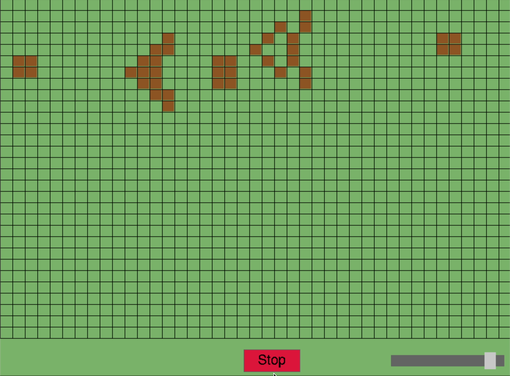

# Conway's Game of Life

A graphical implementation of Conway's Game of Life. I built it for the COMP1921 programming project while I was studying at the University of Leeds.



Required dependencies:
- CMake
- SDL2 and SDL2_ttf libraries

Build and run:
```bash
mkdir build
cd build
cmake ..
make
./conway
```
